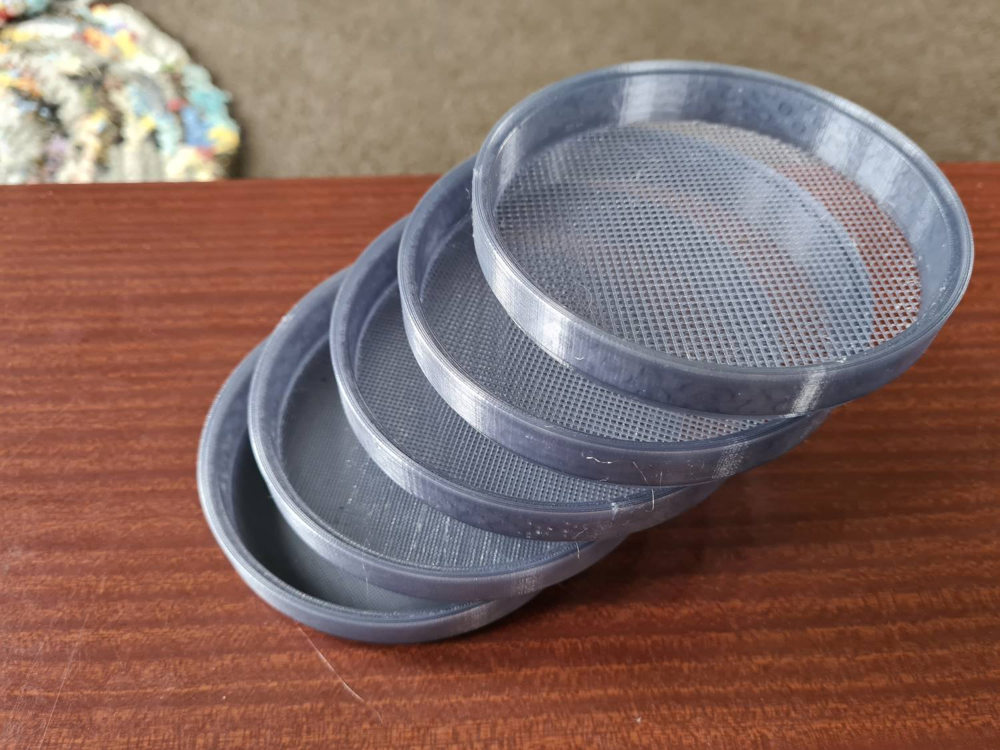
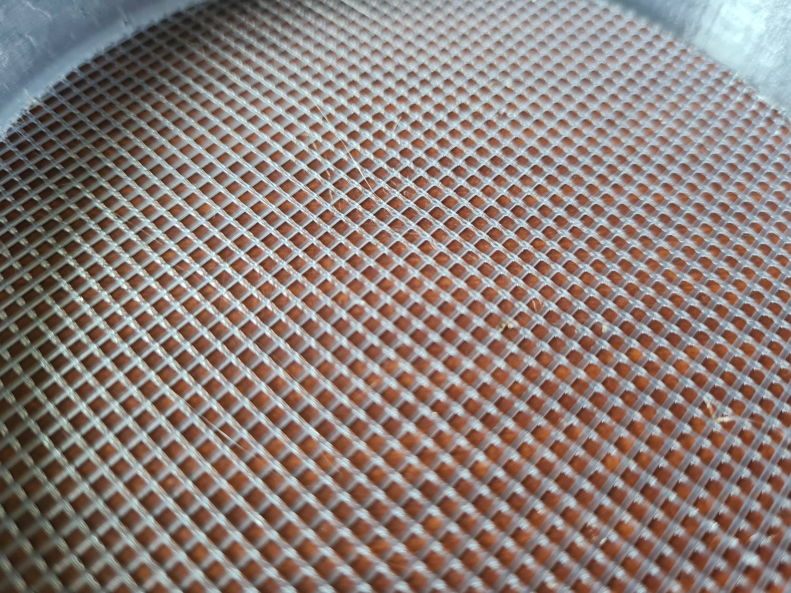
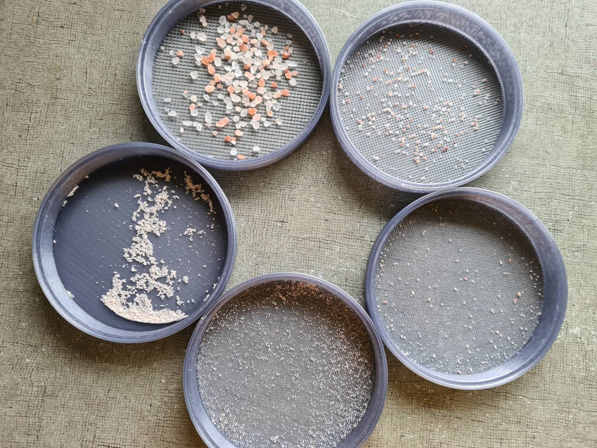
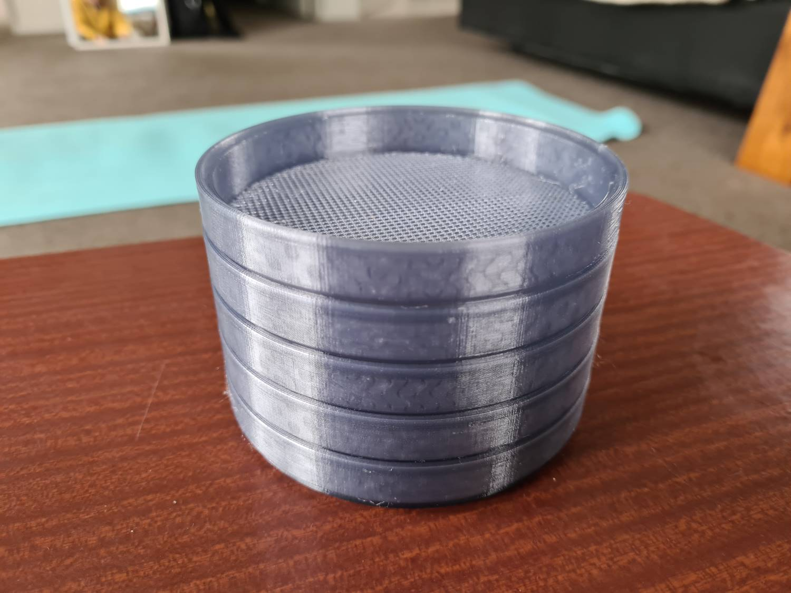

# Mesh Sieve Set

A set of stackable mesh sieves for separating granules by size. Sizes included are from 1.5 mm to 0.250 mm. 

OpenSCAD file is included so you can make custom sizes. All parameters are at the top of the file to make it easy.

Print at 0.2 mm layer height in PLA, PETG or ABS (or anything you want).

If using PrusaSlicer, use version 2.5 or higher with the Arachne perimeter generator for much better printing of the mesh.

